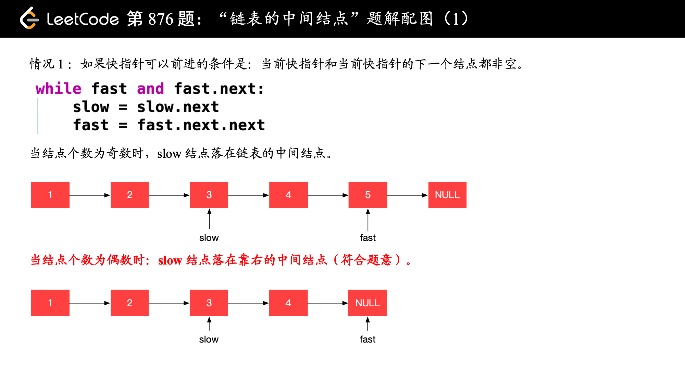

# 算法练习笔记
牛客网前端面试题 https://www.nowcoder.com/activity/oj  

- 2021.04.15
  - 获取url参数
    > + exec：全局匹配，while(r.exec())将正则表达式的结果循环输出
    > + RegExp.$1/2/3 返回正则表达式匹配结果

- 2021.04.17
  - dom节点查找
    > + parentNode 可返回某节点的父节点
    > + Node.contains() 返回一个布尔值，表示传入的节点是否为该节点的后代节点
  - 数组去重
    > + Set: ES6新出的数据结构
  - 斐波那契数列

---  

leetCode 算法入门 https://leetcode-cn.com/study-plan/algorithms/?progress=pg3u6dc
- 2021.11.08
  - 二分查找
    > 前提条件：
    > + 有序数组
    > + 无重复项

- 2021.11.09
  - 704 单链表
    > + 添加操作
    > + 删除操作
  - 141/142 环形链表
    > I: 如果链表中有某个节点，可以通过连续跟踪 next 指针再次到达，则链表中存在环。  
    > II: 给定一个链表，返回链表开始入环的第一个节点。 如果链表无环，则返回 null。
  - 160 相交链表
    > 链式结构中不存在环  
    > 使用双指针将两个列表各走一次，走过的长度相等。当相等时，就是相交的节点

- 2021.11.10
  - 977 双指针排序
    > 一头一尾比较插入
  - 189 旋转数组
    > 1. 全部翻转
    > 2. 分区翻转 

- 2021.11.11
  - 283 移动零
  - 167 两数之和：找两个数满足相加之和等于目标数
    > 前提条件：数组有序  
    > 二分查找 + 双指针 
  - 344 反转字符串
    > 双指针一把嗦
  - 557 反转字符串中的单词
    > 切开对单个单词翻转后合并
    > + Array.from()
    > + Array.join()
  - 876 链表的中间结点
    > 快慢指针一把嗦  
    > + 题目要求结点个数为偶数时： `white(fast && fast.next)`  
    > + 题目要求结点个数为偶数时： `white(fast.next && fast.next.next)` 
    > 

- 2021.11.12
  - 3 无重复字符的最长子串
    >  移动窗口、双指针一把嗦
  - 567 字符串的排列
    > 一开始没有理解题目
    > 题目要求s1是任意排序，我以为要求正序或倒序复合就行
    > 此题的参考答案有点不理解，待复盘